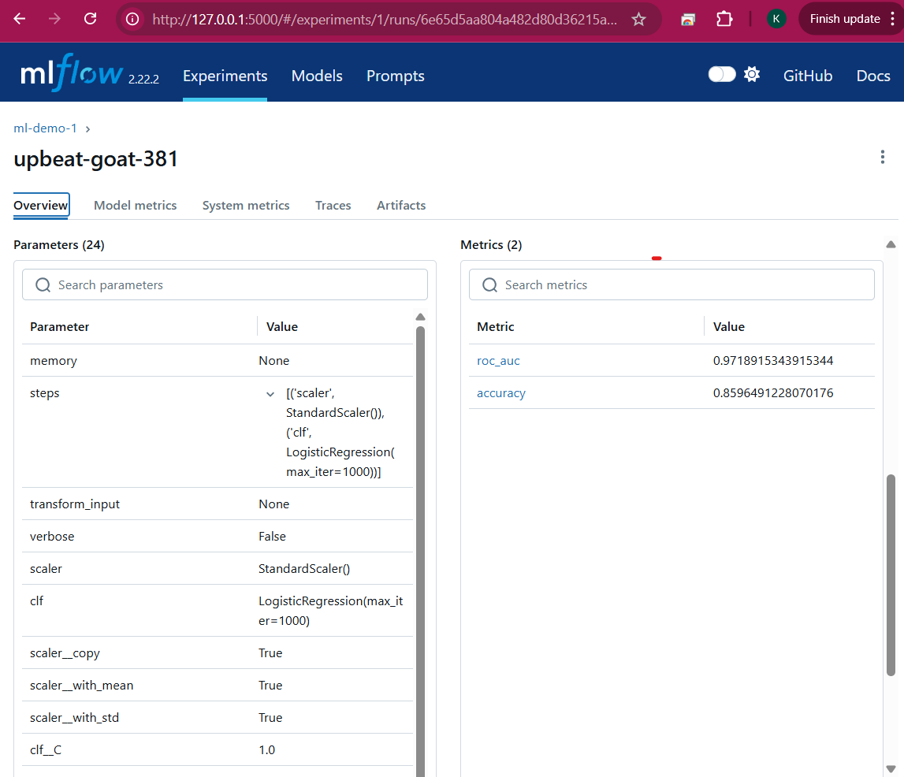
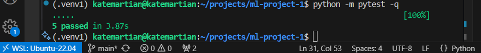

# ML Demo Portfolio (FastAPI + MLflow + Docker)

[](https://github.com/katemartian/mlflow-demo-1/actions/workflows/python-ci.yml)

End-to-end **Machine Learning service** built with **FastAPI**, **MLflow**, and **Docker**, designed to showcase modern MLOps skills.  
This project demonstrates the full lifecycle: training, experiment tracking, containerization, testing, and serving predictions through an API.

---

## Highlights
- **FastAPI REST API** with typed `/predict` endpoint and input validation  
- **MLflow tracking** for experiments, metrics (AUC/Accuracy), and model registry  
- **Docker & Compose stack** (API + MLflow UI)  
- **Automated CI tests** via GitHub Actions (FAST mode for speed)  
- **Screenshots included**: API docs, MLflow UI, prediction examples, and passing tests  

---

## A) Run locally (WSL/Ubuntu)

```bash
python -m venv .venv1 && source .venv1/bin/activate
pip install -r requirements.txt
python src/train_local.py                   # Creates ./models/latest
uvicorn api.app:app --reload --port 8000    # http://127.0.0.1:8000/docs
```

## B) Run in Docker (single container)

```bash
docker build -t mlflow-demo-1 ./api
docker run --rm -p 8000:8000 -v "$(pwd)/models:/app/models:ro" mlflow-demo-1
# Open http://127.0.0.1:8000/docs
```

## C) Run with Docker Compose (API + MLflow UI)

```bash
docker compose up --build
# MLflow UI: http://127.0.0.1:5000
# API docs:  http://127.0.0.1:8000/docs
```

## API Endpoints

.GET /health -> status + model visibility

.POST /predict -> JSON body:

```json
{
    "inputs": [
        {
            "f1": 0.1,
            "f2": -0.2,
            "f3": 1.1,
            "f4": 0.0,
            "f5": 2.3
        }
    ]
}
```

## Tests

```bash
python -m pytest -q
```

## Folder layout
```bash
.
├─ api/                 # FastAPI app + Dockerfile
├─ src/                 # training script (logs to ./mlruns, exports ./models/latest)
├─ models/latest/       # trained model (model.joblib, schema.json)
├─ mlruns/              # MLflow local tracking store (created at first run)
├─ tests/               # API tests
├─ docker-compose.yml   # API + MLflow UI stack
└─ README.md
```

## Screenshots

- FastAPI Docs  
  

- Predict Endpoint Response  
  

- MLflow UI (Experiments)  
  

- MLflow Run Details  
  

- Tests Passing  
  
