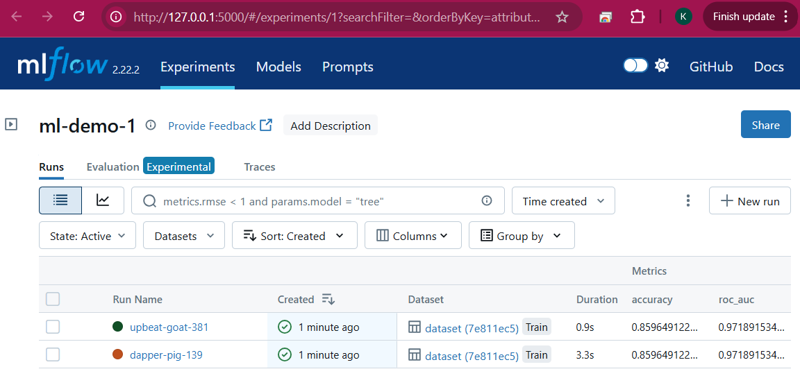
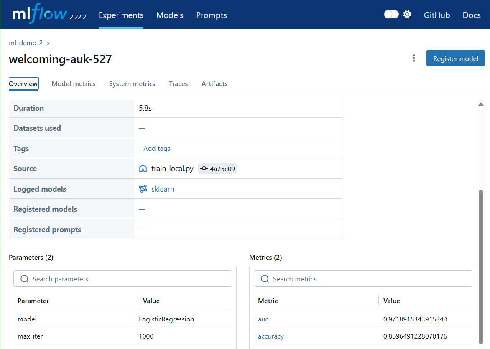
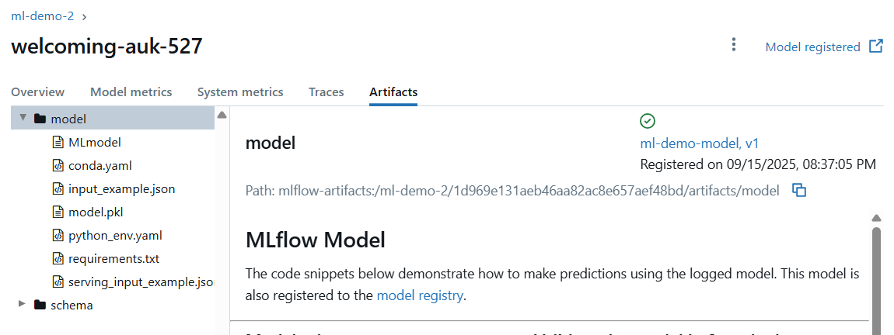
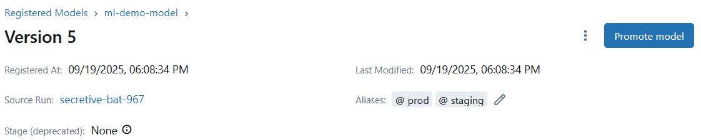
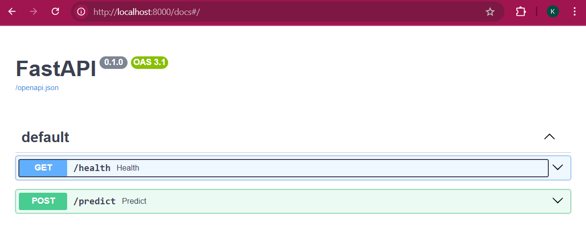
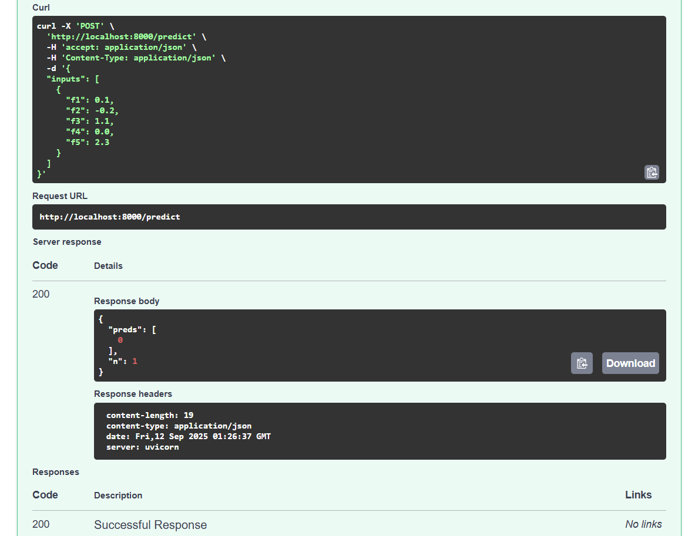

# ML Demo Portfolio (FastAPI + MLflow + Docker)

[](https://github.com/katemartian/mlflow-demo-1/actions/workflows/python-ci.yml)

End-to-end **Machine Learning service** built with **FastAPI**, **MLflow**, and **Docker** — designed to showcase modern **MLOps** on a local stack.

Covers the full lifecycle: training, experiment tracking, model registry (with aliases), testing, CI, containerization, and serving predictions via an API.


## Table of Contents

- [Highlights](#highlights)
- [Architecture](#architecture)
- [Prerequisites](#prerequisites)
- [Quickstart](#quickstart)
- [Running the Stack](#running-the-stack)
- [Training & Registration](#training--registration)
- [Alias-Based Promotion](#alias-based-promotion)
- [Consume the Production Model](#consume-the-production-model)
- [API (FastAPI)](#api-fastapi)
- [Tests & CI](#tests--ci)
- [Project Structure](#project-structure)
- [Screenshots](#screenshots)
- [Troubleshooting](#troubleshooting)
- [License](#license)


---
## Highlights

- **FastAPI** REST API with typed `/predict` endpoint and Pydantic validation.
- **MLflow** tracking (metrics), **Model Registry** with **aliases** (`@staging`, `@prod`).
- **Docker Compose** stack: MLflow UI + API.
- **GitHub Actions** CI: fast, deterministic training (dummy) + tests.
- **Makefile** one-liners to train, register, promote, and predict.
---


## Architecture

```java
Train (local) ──► MLflow Server (docker) ──► artifacts served over HTTP
     │                                     ▲
     └──► models/latest/model.joblib       │
                                           │
FastAPI API (docker) ◄─────────────────────┘  (serves model.joblib)

Model Registry: ml-demo-model
  └── versions v1..vN
       └── aliases:  @staging, @prod (pointers to versions)
```

## Prerequisites

- **Windows + WSL2 (Ubuntu)** or Linux/Mac
- **Docker Desktop** (WSL integration enabled)
- **VS Code** (Remote – WSL recommended)
- **Python 3.10+** (venv)
- **make** (on Ubuntu: `sudo apt update && sudo apt install -y make`)


## Quickstart

```bash
# 1) Clone & enter
git clone https://github.com/katemartian/mlflow-demo-1.git
cd mlflow-demo-1

# 2) Python env
python3 -m venv .venv
source .venv/bin/activate        # Windows/WSL bash
python -m pip install --upgrade pip
pip install -r requirements.txt

# 3) Start services (MLflow UI + API)
make up
# MLflow UI: http://127.0.0.1:5000
# API docs : http://127.0.0.1:8000/docs
```


## Running the Stack

```bash
make up      # build & start MLflow server + API
make down    # stop and remove containers
```
Notes
- MLflow server runs with `--serve-artifacts` and stores data inside the repo (mounted at `/work` in the container).
- Default experiment used: `ml-demo-2`
- Registered model name: `ml-demo-model`


## Training & Registration

### Full training (logs metrics & model to MLflow)

```bash
make train
```
This runs `src/train_local.py` (LogisticRegression on a small dataset), logs **accuracy/AUC** and a model artifact at `artifact_path="model"`.

### Register the latest run & set `@prod`

```bash
make register
```
What it does:
- Creates a new model version from the latest finished run (`runs:/<RUN_ID>/model`)
- Sets alias `@prod` → that version (alias-based promotion)

> Tip: Open the UI at **MLflow** -> **Experiments** -> **ml-demo-2** -> **latest run** -> **Artifacts** -> `model/` -> **⋮** -> **Register Model** to see the **"Registered from run"** badge.

## Alias-Based Promotion

MLflow is deprecating *stages*; this project uses **aliases** (e.g., `@staging`, `@prod`) for promotion.

```bash
make stage       # set @staging -> latest registered version
make prod        # set @prod    -> latest registered version
make verify-aliases
# @staging -> ml-demo-model vN
# @prod    -> ml-demo-model vN

make list-aliases
# v1: aliases=[]
# ...
# vN: aliases=['prod','staging']
```

> In the MLflow UI, switch **New model registry UI** ON on a Version page to see the **Aliases** section.


## Consume the Production Model

Run a one-liner demo:

```bash
make predict
```

Under the hood (`src/load_and_predict.py`):

```python
import mlflow, pandas as pd
mlflow.set_tracking_uri("http://127.0.0.1:5000")

model = mlflow.pyfunc.load_model("models:/ml-demo-model@prod")
X = pd.DataFrame([{
  "f1": 0.5, "f2": -1.2, "f3": 3.1, "f4": 0.7, "f5": 1.0
  }])
print("Prediction:", model.predict(X).tolist())
```


## API (FastAPI)

- Docs (OpenAPI): `http://127.0.0.1:8000/docs`
- Health check:
  - `GET /health`-> `{"status":"ok","model_exists":true}`
- Predict:
  - `POST /predict`
  - **Request body**:
    ```json
    {
      "inputs": [
        { "f1": 0.5, "f2": -1.2, "f3": 3.1, "f4": 0.7, "f5": 1.0 }
      ]
    }
    ```
  - **Response**:
    ```json
    { "preds": [0], "n": 1 }
    ```

> The API reads a local serving artifact at `models/latest/model.joblib` (mounted into the API container).


## Tests & CI

### Run tests locally

```bash
make tests
```
- Includes unit/API tests (pytest).
- `/predict` tests use a small sample and validate schema & responses.

### GitHub Actions (CI)

- Workflow: `.github/workflows/python-ci.yml`
- On each push/PR:
1. Set up Python
2. Install deps
3. FAST training (env FAST_TRAIN=1) to create models/latest/model.joblib instantly
4. Run pytest

This keeps CI **fast and deterministic** without contacting MLflow.

**Badge**: at the top of this README


## Project structure

```
.
├── api/
│   ├── app.py                 # FastAPI app
│   ├── Dockerfile
│   └── requirements.txt       # API subset if separated
├── models/
│   └── latest/                # serving artifact for API (model.joblib, schema.json)
├── scripts/
│   ├── set_alias.py           # set @staging / @prod to latest version
│   ├── verify_aliases.py      # prints alias -> version mapping
│   └── list_aliases.py        # lists every version with its aliases
├── src/
│   ├── train_local.py         # full training (logs to MLflow server)
│   └── load_and_predict.py    # loads models:/ml-demo-model@prod and predicts
├── tests/                     # pytest suite (API tests)
├── docs/
│   └── img/                   # screenshots used in README
├── docker-compose.yml         # MLflow server + API
├── Makefile                   # one-liners: up, train, register, stage, prod, predict
├── requirements.txt
└── README.md
```


## Screenshots

- **MLflow UI (Experiments)**
  

- **Experiment run with metrics & artifacts**  
  

- **Registered model from run (with badge)**  
  

- **Aliases visible on version (New UI toggle ON)**  
  

- **API docs (Swagger UI)**  
  

- **Predict Endpoint Response**  
  


## Troubleshooting

**Docker not found in WSL**
- Enable **WSL Integration** in Docker Desktop → Settings → Resources → WSL Integration.

**PermissionError: `/work` or artifacts path**
- Ensure MLflow server runs with `--serve-artifacts`.
- Use a **new experiment** (e.g., `ml-demo-2`) created after enabling `--serve-artifacts`, so its `artifact_location` is `mlflow-artifacts:/...`.

**Client/Server version mismatch**
- Pin versions in `requirements.txt` and `docker-compose.yml`. Example:
  - `mlflow==2.22.2`, `scikit-learn==1.6.1`
  - `docker-compose.yml`: `image: ghcr.io/mlflow/mlflow:v2.22.2`

**DB schema mismatch**
- Upgrade or reset MLflow DB:
  ```bash
  docker compose run --rm mlflow mlflow db upgrade sqlite:////work/mlflow.db
  # or back up & remove mlflow.db, then restart
  ```

**CI slow or failing to reach MLflow**
- CI uses `FAST_TRAIN=1` path that skips MLflow and writes a dummy `models/latest/model.joblib`.

`python: not found`  
- Use `make PY=python3` train or auto-detect in Makefile:

```makefile
PY ?= $(shell command -v python || command -v python3)
```


## License

This project is licensed under the **MIT License** -- see the [LICENSE](LICENSE) file for details.
